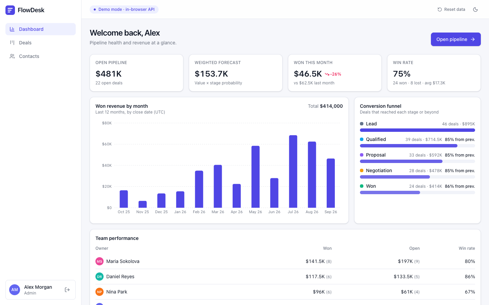
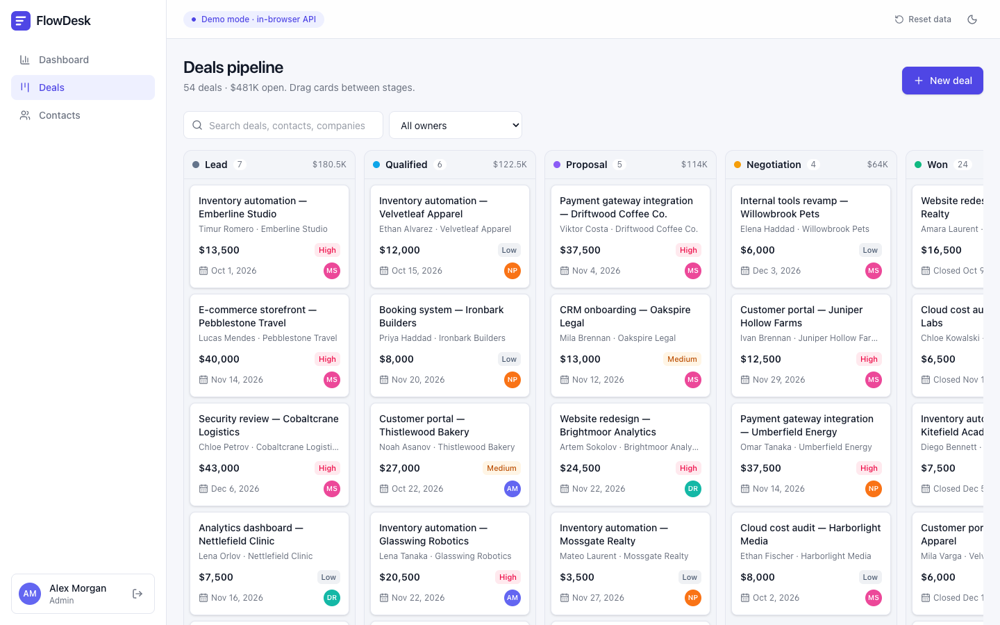
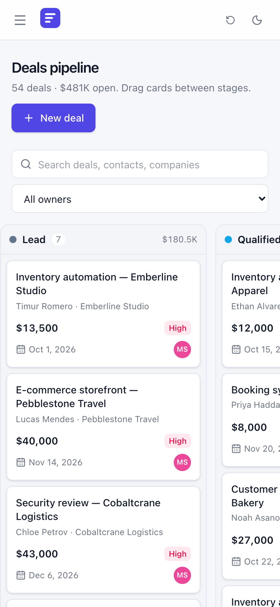

# FlowDesk

Русская версия: [README.ru.md](README.ru.md)



A small CRM for a sales team: a deal kanban, contacts, a deal drawer with notes and history, a dashboard, and two roles, admin and manager. A Next.js static export talks to a Fastify and Prisma API, and a shared package between them holds the zod contract, the permission policy and the analytics functions.

I built this as a demo on generated data; it is not a client product. The name FlowDesk is made up, and every company, contact and deal comes from a seeded generator in [`packages/shared/src/demo-data.ts`](packages/shared/src/demo-data.ts): e-mails on `.example` domains, phone numbers in the reserved 555-01XX range.

Demo: https://sinnercode228.github.io/flowdesk-crm/ runs the same REST API inside the browser, with its state in localStorage, so there is no server behind it. The login form comes prefilled with the admin account, and the Manager button fills in the other one (`admin@flowdesk.example` and `manager@flowdesk.example`, password `demo1234` for both). The Reset data button in the header restores the original data.

## The refresh-token race

The access token is a 15-minute JWT: HS256 via `jose`, with the algorithm pinned during verification and the issuer and audience checked. The refresh token is not a JWT. It is 32 random bytes in base64url, single-use, and valid for 7 days (`JWT_ACCESS_TTL` and `REFRESH_TOKEN_TTL_DAYS` set both lifetimes). The database stores only its SHA-256 hash ([`server/src/lib/tokens.ts`](server/src/lib/tokens.ts)), so a dump of the `RefreshToken` table gives nobody a working token. A slow hash is not needed for 256 random bits.

`POST /api/auth/refresh` revokes the presented token and issues a new pair with the same `familyId`, which all tokens from one login share; `replacedById` links each row to its successor. If a token that is already revoked comes back, either the client sent it twice or someone copied it. The server can't tell which of them is legitimate, so it revokes the whole family and answers `401 TOKEN_REUSED`, and both have to log in again ([`auth.service.ts:38-41`](server/src/modules/auth/auth.service.ts#L38-L41)). The user's other sessions have their own families and are not affected. The API tests and the demo tests both check the chain "rotate → replay the old token → the new one is rejected too".

That rule turns an ordinary client race into a logout. The dashboard sends four requests at once (`useAnalytics`, [`web/src/hooks/queries.ts:58`](web/src/hooks/queries.ts#L58)). With an expired access token all four get a 401. If each of them refreshed on its own, the first refresh would win, the other three would present a token that had just been revoked, and the server would treat that as theft, revoke the family and send the user to the login page. `ApiClient` closes this with one shared promise: `refresh()` keeps the request in flight in `this.refreshing` via `??=`, and concurrent 401s wait for it and retry with the new access token ([`web/src/lib/api/client.ts:67-84`](web/src/lib/api/client.ts#L67-L84)). In [`client.test.ts:27-38`](web/src/lib/api/client.test.ts#L27-L38), two requests go out with an expired access token, and exactly one call reaches `/auth/refresh`.

The server doesn't rely on that. Two requests with the same live token both read it with `revokedAt = null`, and without a guard each would issue its own new pair, leaving the family with two working branches. A conditional update inside the transaction prevents that ([`auth.service.ts:44-60`](server/src/modules/auth/auth.service.ts#L44-L60)):

```ts
return this.prisma.$transaction(async (tx) => {
  // Conditional update guards against two concurrent refreshes with the same token.
  const { count } = await tx.refreshToken.updateMany({
    where: { id: stored.id, revokedAt: null },
    data: { revokedAt: now },
  });
  if (count !== 1)
    throw unauthorized('Refresh token reuse detected, please log in again', 'TOKEN_REUSED');
```

Only one request gets to update the row. The other sees `count === 0` and gets `401 TOKEN_REUSED`, so no second pair is issued. What this does not cover, two tabs of one session and a test with truly parallel refreshes, is listed under [Known limitations](#known-limitations).

Refresh and login are rate-limited separately from the other routes. By default the server lets through 30 refresh requests, 10 login requests and 300 requests to everything else per minute from one IP; the limits come from `RATE_LIMIT_LOGIN_MAX` (tripled for refresh) and `RATE_LIMIT_MAX` ([`auth.routes.ts`](server/src/modules/auth/auth.routes.ts)). On login, the password is checked with scrypt at N=16384, r=8, p=1. The parameters are stored in the hash itself, so they can be raised and old passwords will still verify. If the e-mail isn't found, the password is still checked against a dummy hash, so that login doesn't answer noticeably faster for an unknown address, and the error is `INVALID_CREDENTIALS` in both cases ([`password.ts`](server/src/lib/password.ts), [`auth.service.ts:18-24`](server/src/modules/auth/auth.service.ts#L18-L24)).

## Where a dragged card lands



Each deal has a `stageId` and an integer `position` inside its column. The shortest implementation, writing `position = index` on drop, soon produces duplicates and gaps: cards with equal positions sort arbitrarily, deletes leave holes, and a move between columns never touches the source column. So positions have no fractional values and no gaps: after every move, both affected columns are renumbered to 0..n−1.

`POST /api/deals/:id/move` does this in one Prisma interactive transaction ([`deals.service.ts:156-208`](server/src/modules/deals/deals.service.ts#L156-L208)). It reads the target column without the deal being moved, sorted by `position` and then `createdAt` descending, inserts the deal at the requested index (a position past the end is clamped to the column length) and renumbers. If the stage changed, the source column is renumbered the same way. `reindex` writes only rows whose position changed ([`:34-40`](server/src/modules/deals/deals.service.ts#L34-L40)), so swapping two adjacent cards costs two `UPDATE`s, while a move to the top of a column rewrites the position of every card in it. When the stage changes, the same transaction updates `stageChangedAt` and `closedAt` (set for Won and Lost, cleared when the deal goes back to an open stage) and writes an entry to the activity feed. Creating and deleting keep the invariant too: a new deal goes on top and the rest shift down with a single `updateMany` using `increment` ([`:89-112`](server/src/modules/deals/deals.service.ts#L89-L112)), and deleting does a `decrement` on the cards below ([`:210-221`](server/src/modules/deals/deals.service.ts#L210-L221)).

The client runs the same algorithm: `applyMove` in [`web/src/lib/kanban.ts:17-43`](web/src/lib/kanban.ts#L17-L43), with the same sort order. The optimistic update in `useMoveDeal` applies it to the TanStack Query cache before the server answers and puts the previous list back on error ([`web/src/hooks/queries.ts:78-95`](web/src/hooks/queries.ts#L78-L95)); rows that didn't change keep their object identity, so React doesn't re-render the whole board. The demo server's `/deals/:id/move` handler calls the same function ([`web/src/lib/demo/server.ts:428`](web/src/lib/demo/server.ts#L428)), so the GitHub Pages build orders cards the way the real API does. The integration tests check that positions stay contiguous after every move, create and delete (`expectContiguous` in [`server/test/deals.test.ts`](server/test/deals.test.ts)).

While a search or the owner filter is on, dragging is disabled and a hint appears above the board: "Clear filters to reorder cards." ([`deals-view.tsx:93-106`](web/src/components/deals/deals-view.tsx#L93-L106)). The drop index is computed from the visible column, but a filter hides part of the column, so the server would get the wrong position. A manager can't drag other people's deals either: the card is locked by the same `can()` the server checks. You can drag with a mouse, with a finger after a 180 ms hold, or from the keyboard: Space, arrow keys, Space ([`kanban-board.tsx:142-144`](web/src/components/deals/kanban-board.tsx#L142-L144)).

<p></p>

## What else is in it

- Roles. `admin` can do everything. `manager` creates deals and contacts, edits contacts, edits and moves only their own deals, can't delete or reassign anything and can only read stages. One `can()` from [`permissions.ts`](packages/shared/src/permissions.ts) is called by the server's services, the demo API and the UI, which uses it to hide buttons.
- Deal drawer: edit fields, change stage, notes, activity timeline, delete for admins.
- Contacts: server-side search, column sorting, pagination, 409 on a duplicate e-mail.
- Dashboard: KPIs, revenue by month, conversion by stage, a per-manager table. I compute analytics in JS over the fetched rows, without SQL aggregates: for a CRM this size, that's easier to maintain than SQL written for one specific database. The demo and the server call the same `compute*` functions from [`analytics.ts`](packages/shared/src/analytics.ts), and a server test compares three fields of `/analytics/summary` with `computeSummary` on the seed data.
- API: Fastify 5, zod schemas on requests and responses, Swagger UI at `/docs`, an OpenAPI export to [`docs/openapi.json`](docs/openapi.json) (`npm run openapi -w server`), helmet, CORS, `/api/health`, and on SIGTERM the server closes and disconnects Prisma ([`server/src/index.ts`](server/src/index.ts)).
- Errors come in one format, `{ error: { code, message, details? } }`, including the 404 for an unknown route and the 429. Prisma's P2002 and P2003 become 409, and P2025 becomes 404. If a response doesn't match its schema, the client gets a 500 and the mismatch is logged ([`error-handler.ts`](server/src/plugins/error-handler.ts)).
- Logs: pino replaces `req.headers.authorization`, `req.headers.cookie`, `*.password`, `*.refreshToken` and `*.accessToken` with `[redacted]`, and every response has an `x-request-id` header ([`server/src/app.ts`](server/src/app.ts)).
- In-browser demo. The UI talks to the API through an `ApiClient` with a swappable `Transport` ([`web/src/lib/api`](web/src/lib/api)). With `NEXT_PUBLIC_API_MODE=demo` (the default, and how the GitHub Pages site is built), the transport is `createDemoServer` from [`web/src/lib/demo/server.ts`](web/src/lib/demo/server.ts): a router in the browser with its state in localStorage and a 180 ms delay. It validates requests with the same zod schemas and implements 23 of the 26 API operations; stages are read-only there, same as in the UI. Every request runs on a `structuredClone` of the state and rolls back to the snapshot on error, except `TOKEN_REUSED`: the family revocation is saved before the `throw`, otherwise a replayed token wouldn't revoke anything. The demo router is not a security boundary: its access token is unsigned base64, and passwords and refresh tokens sit in its state as plain text ([`server.ts:166-197`](web/src/lib/demo/server.ts#L166-L197), [`:272`](web/src/lib/demo/server.ts#L272)).
- Data: the database seed and the demo's initial state come from one generator (mulberry32, seed 20260924): 4 users, 6 stages, 60 contacts, 54 deals, with dates counted from the moment the data is generated.
- Accounts come only from the seed. There is no sign-up, password change or "log out everywhere"; logout revokes one token family.
- The dark theme is applied by an inline script before the first paint ([`use-theme.tsx:9`](web/src/hooks/use-theme.tsx#L9)); on phones the sidebar becomes a menu. The interface is in English only.
- Database: the canonical Prisma schema is for PostgreSQL and has a migration. Prisma can't switch providers at runtime, so [`server/scripts/sqlite-schema.mjs`](server/scripts/sqlite-schema.mjs) generates a SQLite copy for local runs and tests. The only place the code differs between providers is case-insensitive search: Postgres needs `mode: 'insensitive'`, and SQLite doesn't accept that option ([`server/src/lib/db.ts`](server/src/lib/db.ts)).

Stack: an npm workspaces monorepo with `web` (Next.js 16 with static export, TanStack Query, dnd-kit, Recharts, Tailwind CSS 4), `server` (Fastify 5, Prisma 6, `jose`, zod 4 via `fastify-type-provider-zod`, Swagger UI) and `packages/shared`.

## Running it

1. Use Node.js 22; that's what `.nvmrc`, CI and the Docker images use, and `engines` in the root `package.json` allows 20.9 or newer. Install dependencies from the repository root with `npm install`.
2. Front end only, in demo mode: `npm run dev`, then open http://localhost:3000. No backend is needed.
3. Front end against the real API on SQLite, without Docker:

   ```bash
   cp server/.env.example server/.env
   npm run db:setup:sqlite -w server    # SQLite schema, Prisma client, tables, seed
   npm run dev:server                   # API at http://localhost:4000/api, Swagger UI at http://localhost:4000/docs
   ```

   Then, in a second terminal:

   ```bash
   NEXT_PUBLIC_API_MODE=http NEXT_PUBLIC_API_URL=http://localhost:4000/api npm run dev:web
   ```

   Running `db:setup:sqlite` again, or `npm run db:seed -w server`, deletes all data, users and sessions included, before seeding ([`server/src/db/seed.ts:22-28`](server/src/db/seed.ts#L22-L28)).

4. Everything in Docker (PostgreSQL 17, the API, and nginx serving the static build): `docker compose up --build`. The web app is at http://localhost:3000 and Swagger UI at http://localhost:4000/docs. On startup, the API container runs `prisma migrate deploy` and seeds the database only if it is empty ([`server/docker-entrypoint.sh`](server/docker-entrypoint.sh)). Compose takes `JWT_ACCESS_SECRET` from the environment and falls back to a value written in [`docker-compose.yml`](docker-compose.yml); set your own for anything beyond localhost (see [Known limitations](#known-limitations)).
5. Configuration. Example server variables are in [`server/.env.example`](server/.env.example), and the full list with defaults is in [`server/src/config/env.ts`](server/src/config/env.ts), which validates them with zod at startup: a `JWT_ACCESS_SECRET` shorter than 32 characters won't pass, and with `NODE_ENV=production` the server won't start with the dev secret from `.env.example`. The client has three variables, see [`web/.env.example`](web/.env.example): `NEXT_PUBLIC_API_MODE`, `NEXT_PUBLIC_API_URL`, `NEXT_PUBLIC_BASE_PATH`.
6. Checks: `npm test`, `npm run lint`, `npm run typecheck`, `npm run format:check`. `npm run ci` runs lint, typecheck, tests and the build in sequence.

## Known limitations

1. Two tabs of one session log each other out ([issue #1](https://github.com/sinnercode228/flowdesk-crm/issues/1)). `SessionStore` keeps the token pair in memory and doesn't listen for the `storage` event ([`session-store.ts`](web/src/lib/api/session-store.ts)), and the shared refresh promise only works within one tab. After tab A rotates the token, tab B presents the revoked one on its own refresh, the server revokes the family, and B calls `session.set(null)` ([`client.ts:61`](web/src/lib/api/client.ts#L61)), which also removes A's fresh pair from localStorage. B is logged out right away, A when its access token expires.
2. Tokens are stored in localStorage ([`session-store.ts:39`](web/src/lib/api/session-store.ts#L39)), where any script on the page can read them. A refresh token in an httpOnly cookie would be the right way to do it; that's the part I'd redo.
3. The refresh race has no concurrent test: [`server/test/auth.test.ts:96-121`](server/test/auth.test.ts#L96-L121) replays a token only sequentially. The two reuse branches also differ: losing the conditional update ([`auth.service.ts:50-51`](server/src/modules/auth/auth.service.ts#L50-L51)) leaves the family alive, while finding an already revoked token ([`:38-41`](server/src/modules/auth/auth.service.ts#L38-L41)) revokes it, so which one a late duplicate hits depends on timing. The code has no comment saying whether that difference is intended.
4. Revoked and expired refresh tokens are never deleted. The only `deleteMany` on `RefreshToken` is in the seed ([`server/src/db/seed.ts:27`](server/src/db/seed.ts#L27)), so the table only grows.
5. `move` doesn't lock the column's rows, and `(stageId, position)` has a plain index, not a unique constraint ([`schema.prisma:105`](server/prisma/schema.prisma#L105)). Two concurrent moves into the same stage on PostgreSQL can leave deals with the same `position`. The order stays deterministic (`createdAt` is the second sort key), and the next move into that column renumbers it.
6. `reindex` issues one `UPDATE` per shifted row ([`deals.service.ts:34-40`](server/src/modules/deals/deals.service.ts#L34-L40)). Moving a card to the top of a column with a few hundred deals means a few hundred queries inside an interactive transaction that runs with Prisma's default 5-second timeout, since `move` passes no `timeout` option.
7. Changing the stage from the deal drawer always puts the card at position 0 of the new column ([`deal-drawer.tsx:105`](web/src/components/deals/deal-drawer.tsx#L105)).
8. `docker compose up` starts the API with `NODE_ENV=production` and, unless `JWT_ACCESS_SECRET` is set, with the fallback secret from [`docker-compose.yml:25,29`](docker-compose.yml#L25-L29). The startup check in [`env.ts:27-35`](server/src/config/env.ts#L27-L35) rejects only the dev secret from `.env.example`, so the compose value passes it.
9. `trustProxy: true` is set unconditionally ([`server/src/app.ts:62`](server/src/app.ts#L62)). Without a reverse proxy in front of the API, a client that sends a different `X-Forwarded-For` value with each request is counted as a new IP every time and never reaches the login limit. The limiter keeps its counters in process memory.
10. The API integration tests only run on SQLite. The `api-postgres` job in [`ci.yml`](.github/workflows/ci.yml) brings up PostgreSQL 17, but it only applies the migration and runs the seed, so the `mode: 'insensitive'` branch in [`db.ts:9`](server/src/lib/db.ts#L9) has no automated test.
11. Nothing is paginated on the deals side. `GET /api/deals` returns the whole board, and each of the four analytics endpoints reads all deals and stages on every request ([`analytics.routes.ts:23-32`](server/src/modules/analytics/analytics.routes.ts#L23-L32)), while the dashboard calls all four. The deals page also filters on the client ([`deals-view.tsx:28-38`](web/src/components/deals/deals-view.tsx#L28-L38)), although `GET /api/deals` accepts `search` and `ownerId`. With 54 deals this doesn't matter; with thousands, analytics would need SQL aggregates and the board would need pagination.
12. Stages can only be managed through the API. `POST`, `PATCH` and `DELETE /api/stages` exist ([`stages.routes.ts`](server/src/modules/stages/stages.routes.ts)), but the web client only lists stages ([`client.ts:107`](web/src/lib/api/client.ts#L107)) and the demo server implements only `GET /stages` ([`server.ts:321`](web/src/lib/demo/server.ts#L321)).

## Tests and CI

[](https://github.com/sinnercode228/flowdesk-crm/actions/workflows/ci.yml)

97 tests on Vitest:

| Package | Tests | What they cover |
| --- | ---: | --- |
| `packages/shared` | 18 | analytics functions, `can()`, zod schemas, determinism and integrity of the demo data |
| `server` | 48 | HTTP via supertest: login, refresh token rotation and reuse, expired and forged JWTs, moves with renumbering, search, sorting and pagination, 409 on a duplicate, manager permissions for contacts and stages, analytics, rate limit |
| `web` | 31 | the demo API (contract, permissions, rollback of failed requests, persistence), `ApiClient`, `applyMove`, formatting, components via Testing Library |

The API tests start a real Fastify instance on a random loopback port and send requests through supertest. [`global-setup.ts`](server/test/global-setup.ts) creates a seeded SQLite template database once, and each test file copies it for itself ([`helpers.ts`](server/test/helpers.ts)), so the files can run in parallel.

```bash
npm test                                            # all three packages
npm run lint && npm run typecheck && npm run format:check
```

[`.github/workflows/ci.yml`](.github/workflows/ci.yml) runs lint, prettier, typecheck, tests and the build; a second job applies the migration and the seed to PostgreSQL 17, and a third builds the Docker images. [`.github/workflows/pages.yml`](.github/workflows/pages.yml) builds the demo with `NEXT_PUBLIC_BASE_PATH=/<repository name>` and deploys it with `actions/deploy-pages`; the repository's Pages source has to be set to GitHub Actions.

## Repository map

```
packages/shared/   zod contract, RBAC, analytics, demo dataset generator, their tests
server/            Fastify API: src/modules/{auth,deals,contacts,stages,analytics,users,health}, prisma/, test/
web/               Next.js: src/app, src/components, src/hooks, src/lib/{api,demo,kanban.ts}
docs/              screenshots, openapi.json
```

---

Built by Грешный Котик (sinnercode). I take freelance work like this: Telegram [@sinnercode](https://t.me/sinnercode). License: [MIT](LICENSE).
