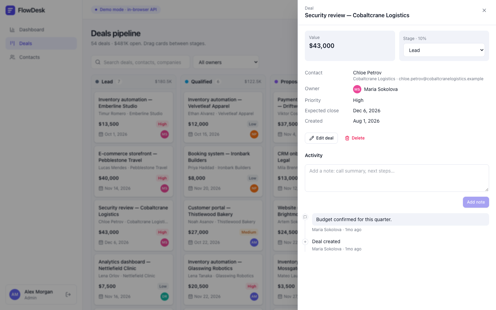
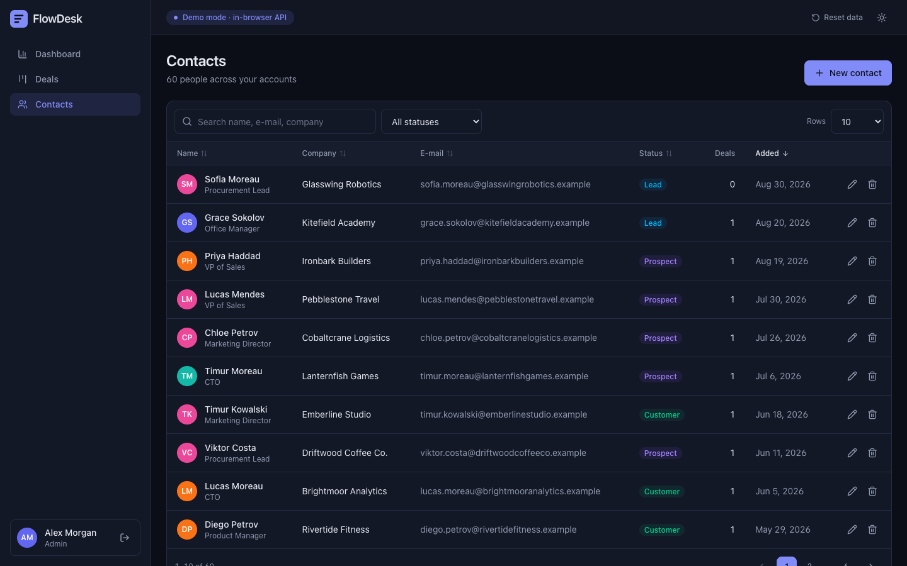
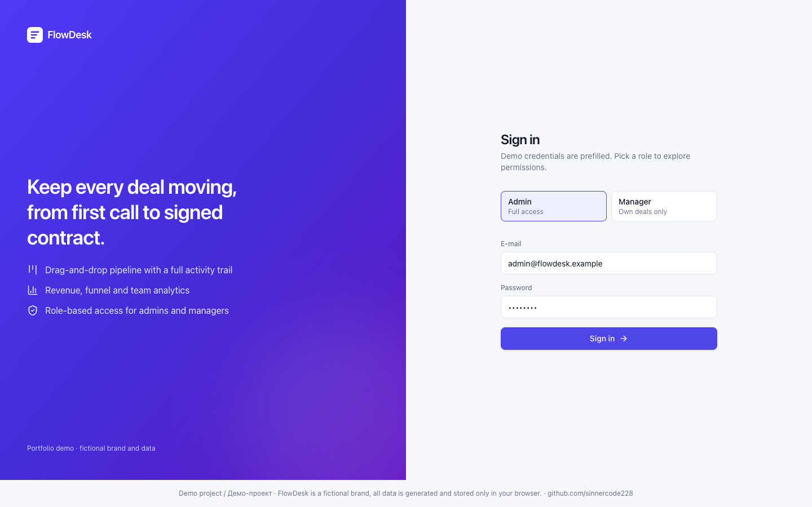

# FlowDesk — mini-CRM / sales dashboard

[](https://github.com/sinnercode228/flowdesk-crm/actions/workflows/ci.yml)
[](https://github.com/sinnercode228/flowdesk-crm/actions/workflows/pages.yml)

**Live demo:** https://sinnercode228.github.io/flowdesk-crm/ — работает без бэкенда, данные хранятся в браузере.

> **Демо-проект / Demo project.** FlowDesk — вымышленный бренд; все компании, люди, e-mail и телефоны сгенерированы
> (домены `.example`, номера `555-01XX`). / FlowDesk is a fictional brand; all data is generated.


**Русский** · [English](#english)

## О проекте

FlowDesk — full-stack мини-CRM для отдела продаж: канбан сделок с drag-and-drop, справочник контактов, карточка
сделки с историей и заметками, аналитика (выручка по месяцам, воронка, результаты команды), роли admin/manager.

Монорепозиторий на npm workspaces:

| Пакет             | Стек                                                                                     |
| ----------------- | ---------------------------------------------------------------------------------------- |
| `web/`            | Next.js 16 (App Router, static export), TypeScript, Tailwind CSS 4, TanStack Query, dnd-kit, Recharts |
| `server/`         | Node.js, Fastify 5, Prisma 6, PostgreSQL (SQLite для тестов), JWT + refresh-токены, zod, Swagger |
| `packages/shared` | Общий REST-контракт (zod-схемы), политика RBAC, расчёт аналитики, детерминированный демо-датасет |

### Возможности

- **Вход** — демо-учётки подставлены автоматически, переключатель ролей admin / manager.
- **Канбан сделок** — перетаскивание мышью, тачем и с клавиатуры; оптимистичное обновление с откатом при ошибке;
  суммы по колонкам, поиск и фильтр по владельцу.
- **Карточка сделки (drawer)** — редактирование, смена стадии, заметки, лента активности, удаление (только admin).
- **Контакты** — серверный поиск, сортировка по колонкам, пагинация, создание / редактирование / удаление.
- **Аналитика** — KPI (открытая воронка, взвешенный прогноз, выигрыш за месяц, win rate), выручка по месяцам,
  конверсия по стадиям, таблица по менеджерам.
- **Тёмная / светлая тема** без мигания при загрузке, адаптивная вёрстка (сайдбар превращается в меню на мобильных).

### Архитектура

```
web (Next.js) ──ApiClient──► Transport ─┬─► HTTP ──► Fastify API ──► Prisma ──► PostgreSQL
                                        └─► Demo server (в браузере) ──► localStorage
                     ▲                                  ▲                  ▲
                     └──────── @flowdesk/shared: zod-схемы, RBAC `can()`, аналитика, демо-данные ────┘
```

- Весь UI ходит в API через один `ApiClient` (bearer-токен, автоматический refresh с одним общим запросом,
  выход при неудачном refresh). Под ним — подменяемый `Transport`.
- **Демо-режим** (`NEXT_PUBLIC_API_MODE=demo`, по умолчанию): `web/src/lib/demo/server.ts` принимает *те же*
  REST-запросы (метод + путь + query + body), валидирует их *теми же* zod-схемами, применяет *ту же* политику RBAC
  и возвращает *те же* DTO и конверт ошибок `{ error: { code, message, details? } }`. Состояние хранится в
  localStorage; кнопка «Reset data» возвращает исходный датасет. Поэтому GitHub Pages-версия полностью интерактивна.
- **Реальный API** (`NEXT_PUBLIC_API_MODE=http`, `NEXT_PUBLIC_API_URL=http://localhost:4000/api`) — никаких
  изменений в UI.
- Аналитика считается чистыми функциями из `shared`, поэтому цифры в обоих режимах совпадают (проверено тестами).

### Бэкенд

- **Аутентификация:** access JWT (HS256, 15 мин, `jose`) + непрозрачные refresh-токены с ротацией. В БД хранится
  только SHA-256 хэш; повторное использование уже ротированного токена отзывает всё «семейство» сессии.
  Пароли — scrypt; при неизвестном e-mail тоже выполняется проверка хэша (без утечки по таймингу).
- **RBAC:** `admin` — всё; `manager` — создаёт сделки и контакты, редактирует/двигает только свои сделки, не удаляет
  и не переназначает, стадии только читает. Политика одна на сервер, демо-API и UI (`packages/shared/src/permissions.ts`).
- **REST:** `/api/auth/*`, `/api/users`, `/api/stages`, `/api/deals` (+ `/move`, `/notes`), `/api/contacts`,
  `/api/analytics/{summary,revenue-by-month,funnel,leaderboard}`, `/api/health`.
- **Swagger UI:** `http://localhost:4000/docs`, OpenAPI генерируется из zod-схем (`npm run openapi -w server` →
  `docs/openapi.json`).
- **Надёжность:** перемещение сделки — одна транзакция с переиндексацией колонок; rate limit (глобальный + строже на
  `/auth/login`); helmet, CORS; структурированные логи pino с `x-request-id` и редактированием токенов/паролей;
  валидация ответов по схеме; корректное завершение по SIGTERM.
- **БД:** каноническая схема Prisma для PostgreSQL + миграция; SQLite-вариант генерируется скриптом для dev/тестов.

## Быстрый старт

Требования: Node.js ≥ 20.9 (проверено на 22 и 25), npm ≥ 10.

```bash
npm install

# 1) Только фронтенд в демо-режиме (без бэкенда)
npm run dev                      # http://localhost:3000

# 2) Фронтенд + реальный API на SQLite (без Docker)
cp server/.env.example server/.env
npm run db:setup:sqlite -w server   # генерирует клиент, создаёт схему, заливает демо-данные
npm run dev:server                  # http://localhost:4000/api, Swagger: /docs
NEXT_PUBLIC_API_MODE=http NEXT_PUBLIC_API_URL=http://localhost:4000/api npm run dev:web

# 3) Всё в Docker: PostgreSQL + API + web
docker compose up --build        # web: http://localhost:3000, API: http://localhost:4000/docs
```

Демо-учётки (пароль `demo1234`): `admin@flowdesk.example`, `manager@flowdesk.example`.

### Скрипты

| Команда                 | Что делает                                                      |
| ----------------------- | --------------------------------------------------------------- |
| `npm test`              | Все тесты: shared, интеграционные тесты API (SQLite), web       |
| `npm run lint`          | ESLint (typescript-eslint, react-hooks)                         |
| `npm run typecheck`     | `tsc --noEmit` во всех пакетах                                  |
| `npm run build`         | Сборка API (tsup) и статического экспорта web                   |
| `npm run build:pages`   | Статическая сборка с `basePath=/flowdesk-crm` для GitHub Pages  |
| `npm run format:check`  | Prettier                                                        |

## Тесты

**97 тестов**, Docker не нужен:

- `server/test` — **48** интеграционных тестов API через HTTP (supertest): логин, ротация и reuse-detection refresh-токенов,
  истёкшие/подделанные JWT, RBAC, drag-and-drop с переиндексацией колонок, поиск/сортировка/пагинация контактов,
  409 на дубликаты, стадии, аналитика, Swagger, 404-конверт, rate limit. Каждый файл получает свою копию заранее
  засеянной SQLite-базы, поэтому файлы идут параллельно.
- `web/src` — **31** тест (Vitest + Testing Library): демо-API (контракт, RBAC, атомарность, персистентность),
  `ApiClient` (автоматический refresh, один refresh на параллельные запросы, сброс сессии), логика канбана,
  форматирование, компоненты (таблица контактов, пагинация, KPI, карточка сделки).
- `packages/shared` — **18** тестов: аналитика, zod-контракт и демо-датасет.

Дополнительно вручную проверено: миграция + сид + API на PostgreSQL 17.

## CI/CD и GitHub Pages

- `.github/workflows/ci.yml` — lint, prettier, typecheck, тесты, сборка; отдельный job применяет миграцию и сид к
  PostgreSQL-сервису; сборка Docker-образов.
- `.github/workflows/pages.yml` — собирает статический демо-режим с `NEXT_PUBLIC_BASE_PATH=/<имя репозитория>` и
  публикует через `actions/upload-pages-artifact` + `actions/deploy-pages`.
  В настройках репозитория: **Settings → Pages → Source: GitHub Actions**.

## Скриншоты

| Канбан | Карточка сделки |
| --- | --- |
|  |  |
| **Контакты (тёмная тема)** | **Вход** |
|  |  |

<p align="center"></p>

## Структура

```
packages/shared/   zod-контракт, RBAC, аналитика, демо-датасет (+ тесты)
server/            Fastify API: src/modules/{auth,deals,contacts,stages,analytics,users,health}, prisma/, test/
web/               Next.js: src/app (маршруты), src/components, src/hooks, src/lib/{api,demo}
docs/              скриншоты, openapi.json
```

---

<a id="english"></a>

## English

FlowDesk is a full-stack mini-CRM / sales dashboard: a drag-and-drop deals pipeline, a contacts directory, a deal
drawer with notes and an activity timeline, analytics (monthly revenue, stage funnel, team leaderboard) and
admin/manager roles. **Live demo:** https://sinnercode228.github.io/flowdesk-crm/ (no backend needed).

**Stack.** `web/`: Next.js 16 App Router (static export), TypeScript, Tailwind CSS 4, TanStack Query, dnd-kit,
Recharts. `server/`: Fastify 5, Prisma 6, PostgreSQL (SQLite in tests), JWT access tokens + rotating refresh tokens
with reuse detection, RBAC, zod validation, Swagger/OpenAPI, rate limiting, pino logging with request ids.
`packages/shared/`: the REST contract as zod schemas, the RBAC policy, pure analytics functions and a deterministic
demo dataset — used by the server, the in-browser demo API and the UI alike.

**How the demo works.** The UI talks to a single typed `ApiClient` (bearer auth, one shared refresh on 401, logout on
failed refresh) over a pluggable `Transport`. In demo mode (default) the transport routes the very same REST requests
to an in-browser server that validates them with the same zod schemas, enforces the same RBAC, returns the same DTOs
and error envelope, and persists state in localStorage ("Reset data" restores the seed). Set
`NEXT_PUBLIC_API_MODE=http` and `NEXT_PUBLIC_API_URL` to use the real API — no UI changes.

**Run it.**

```bash
npm install
npm run dev                                   # demo mode, http://localhost:3000
cp server/.env.example server/.env && npm run db:setup:sqlite -w server
npm run dev:server                            # API http://localhost:4000/api, Swagger /docs
NEXT_PUBLIC_API_MODE=http npm run dev:web     # web against the real API
docker compose up --build                     # PostgreSQL + API + web
```

Demo accounts (password `demo1234`): `admin@flowdesk.example` (full access), `manager@flowdesk.example`
(own deals only, no deletes).

**Quality.** 97 tests (48 API integration tests over HTTP on isolated SQLite copies, 31 web tests, 18 shared tests),
ESLint + Prettier + strict TypeScript, CI (lint, typecheck, tests, build, PostgreSQL migration job, Docker build) and a
GitHub Pages workflow (`actions/upload-pages-artifact` + `actions/deploy-pages`, Pages source: GitHub Actions).

**Demo project.** FlowDesk is a fictional brand; every company, person and contact detail is generated.

## License

MIT © sinnercode228
